# CSS to the Rescue - Jorn Veltrop


## [Live demo](https://jornveltrop.github.io/css-to-the-rescue-2122/)

## Description
Dit is mijn repository voor het vak CSS to the rescue in de minor CMDA Web design & development.In dit vak maken we een interactieve webpagina maken met alleen CSS & HTML. We mochten geen gebruik maken van JavaScript. 

Ik heb gekozen om een Visual Synthesizer te maken. Waar je normaal de sound beïnvloedt, beïnvloed je nu de visuals.

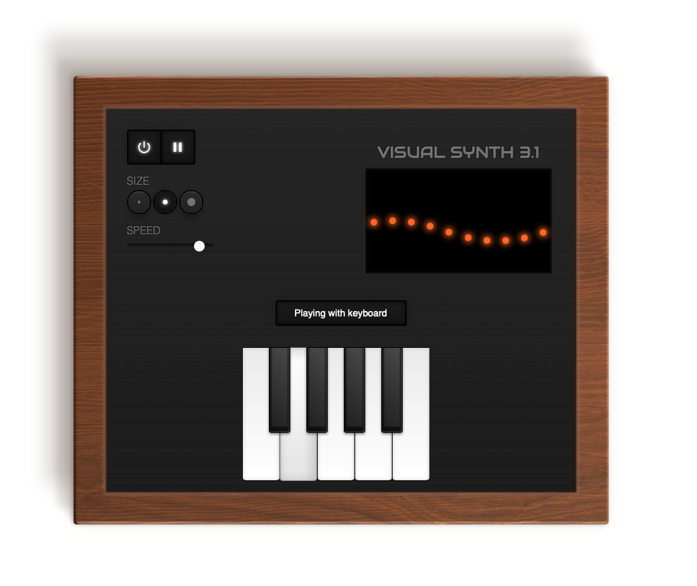

## Table of Contents
- [Proces](#Proces)
- [Meta](#meta)
- [License](#license)

## Proces

## Week 1
### Interactie testjes
In de eerste week heb ik een snelle opzet gemaakt met meerdere varianten om de view met dots visueel te beïnvloeden. Hiervoor had ik een aantal verschillende inputs en manieren gebruikt. Zoals :active en een input veld waarin je kunt typen. Ook checkboxes heb ik gebruikt om wat eerste testjes te doen. Erg gaaf om te zien dat dit gewoon met CSS kan.
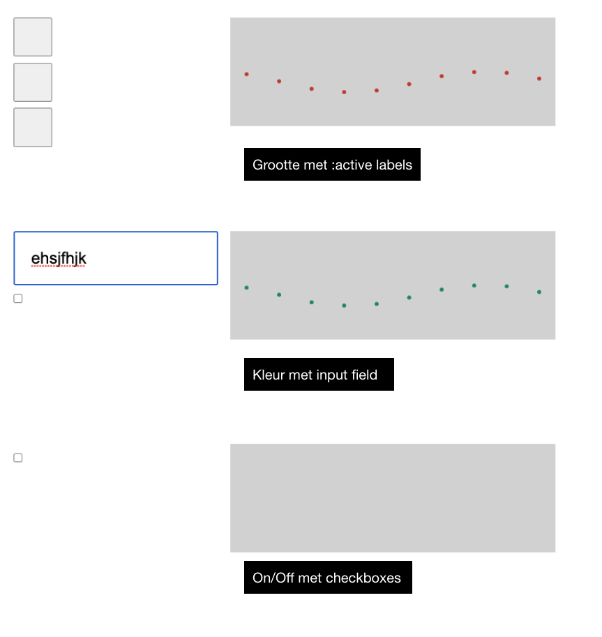

**Animatie**
Voor de synthesizer gebruik ik een lijst met LI's om deze bolletjes uiteindelijk te animeren in een wave vorm. Deze krijgen een wave omdat de animatie met een delay per dot later begint.

### Has() 
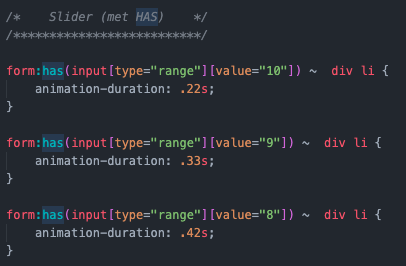

Ik heb ook de nieuwe selector Has() gebruikt. Deze selector werkt alleen nog een Safari technology preview. Has() is een hele krachtige selector. Het is namelijk een parent selector. Hiermee kun je dus stylen op basis wat er in een element zit. 

Ik heb deze selector gebruikt om op basis van de value van de slider de speed van de dots animatie aan te passen. Door deze selector kan de slider in het control panel links blijven staan, maar kun je vervolgens ergens anders de styling aanpassen. In dit geval dus de dots.


### Toch JavaScript?!
Voor deze slider is helaas wel 1 regel inline JavaScript nodig. Het probleem van de slider is namelijk dat deze na het veranderen van de slider de value niet update. Om deze value te updaten is deze code nodig.

```
oninput="this.setAttribute('value', this.value);
```
Deze code heb ik vervolgens ook moeten gebruiken voor de tekst input. Deze input moet namelijk ook zijn value updaten.


## Week 2
### Synth vormgeving
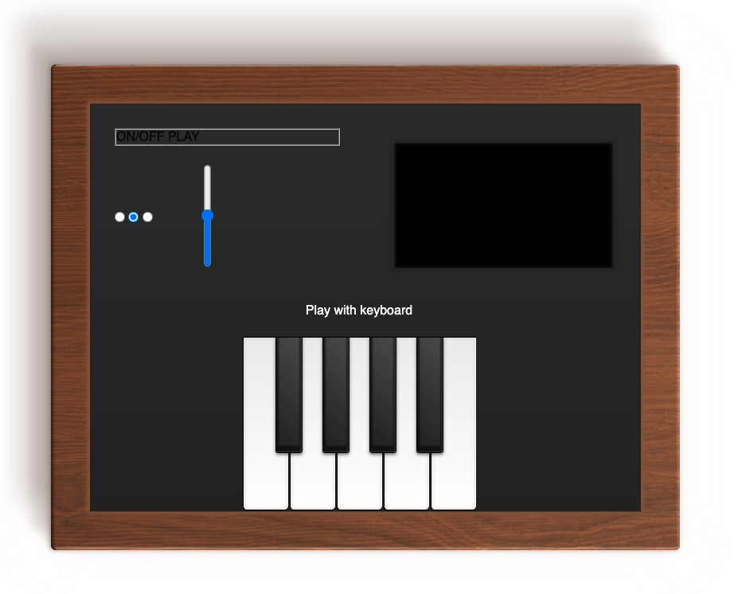

In week 2 ben ik begonnen aan de styling van de uiteindelijke Synthesizer. De uitdaging lag 'm hier vooral bij de omlijsting. Deze wilde ik namelijk een houten texture geven, zodat het op een echte Synth lijkt. Dit heb ik uiteindelijk met een container voor elkaar gekregen samen met 'position: absolute' en een blend-mode.


### Spelen met Custom Properties
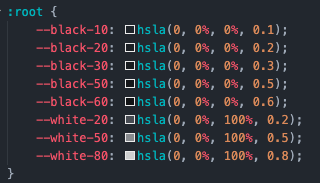

Deze week heb ik ook wat gespeeld met custom properties. Deze zijn handig als je veel dezelfde waardes invult bij je styling. Zo kun je deze makkelijk in 1x aanpassen.

Ik heb een paar van mijn zwart-wit kleuren en verschillende opacity's daarvan erin gezet, om ermee te oefenen. 

### Keyboard
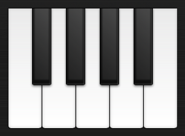

Daarnaast heb ik deze week ook de piano toetsen gemaakt. Deze zijn gebaseerd op een eerder CSS ontwerp van Zastrow. Door verschillende shadows, zijn de toetsen heel realistisch geworden.
[Inspiratie/bron](https://codepen.io/zastrow/pen/kxdYdk)

## Week 3
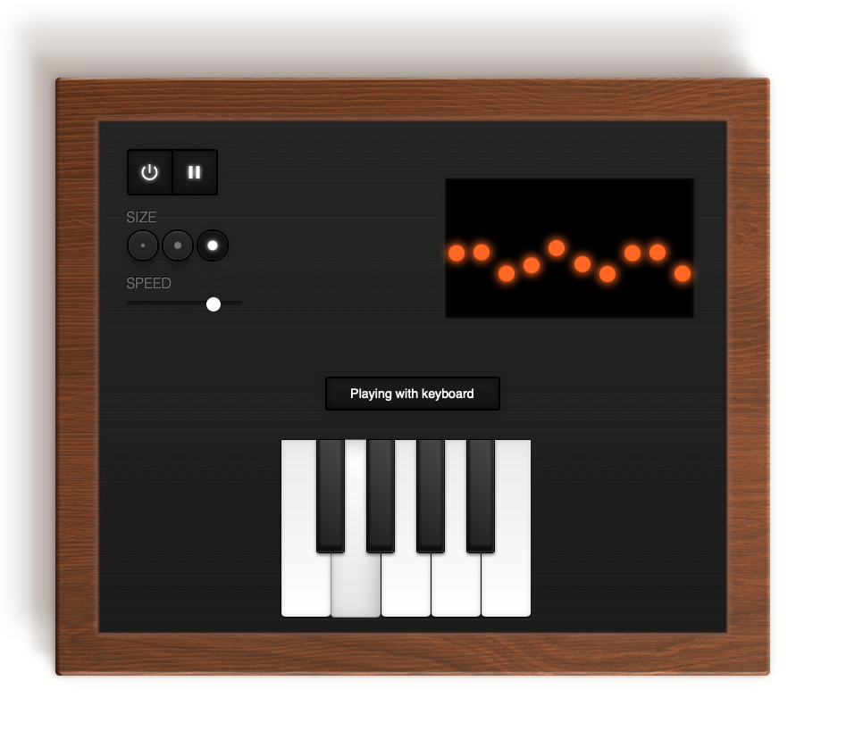

### Styling buttons
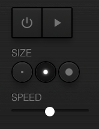
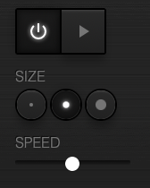

In week 3 heb ik de styling van de buttons aangepakt. Deze wilde ik realistischer (skeuomorph design) maken. Ik heb daarom icons in de buttons gezet. Deze buttons ben ik gaan stylen met shadows. Als deze active is gaat er ook een glow aan op de geselecteerde knop. Zo lijkt het alsof er echt een lichtje gaat branden. Ook heb ik de tekst boven de buttons toegevoegd, zodat de gebruiker weet wat de controls beïnvloeden.


### SVG Filter metal texture
Om de Synthesizer nog realistischer te laten lijken wilde ik een metal brushed texture toevoegen. Dit heb ik gedaan met een SVG filter. Deze kun je vervolgens toepassen op de background van de Synth.

**SVG Filter Texture**

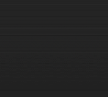

**SVG Filter HTML**


**SVG Filter CSS**


## Week 4
### Responsive
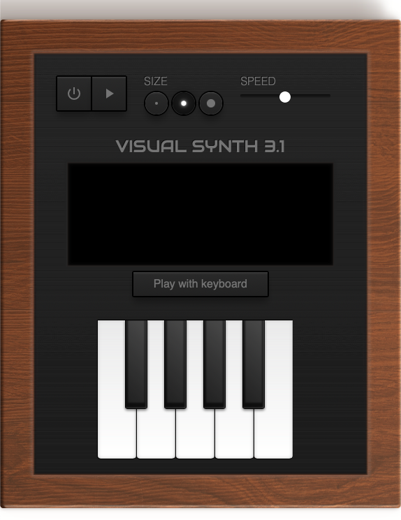

In week vier heb ik de Synth responsive gemaakt. Dit heb ik gedaan met de Media query. Normaal gebruik ik daar altijd pixels voor. Dit keer heb ik geëxperimenteerd met aspact-ratio.

```
@media (max-aspect-ratio: 1/1) {
}
```


### Titel 
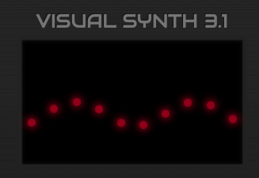

Om het helemaal af te maken:
Zoals elke Synthesizer, uiteraard een titel in een lekker Retro font. Dit keer 'Audiowide'.


## Eindresultaat

 


## Meta
Jorn Veltrop - 500800436 - [https://github.com/jornveltrop/css-to-the-rescue-2122](https://github.com/jornveltrop/css-to-the-rescue-2122)

## License
Usage is provided under the [MIT License](https://github.com/git/git-scm.com/blob/master/MIT-LICENSE.txt) MIT. See [LICENSE](https://github.com/jornveltrop/css-to-the-rescue-2122/blob/main/LICENSE) for the full details.